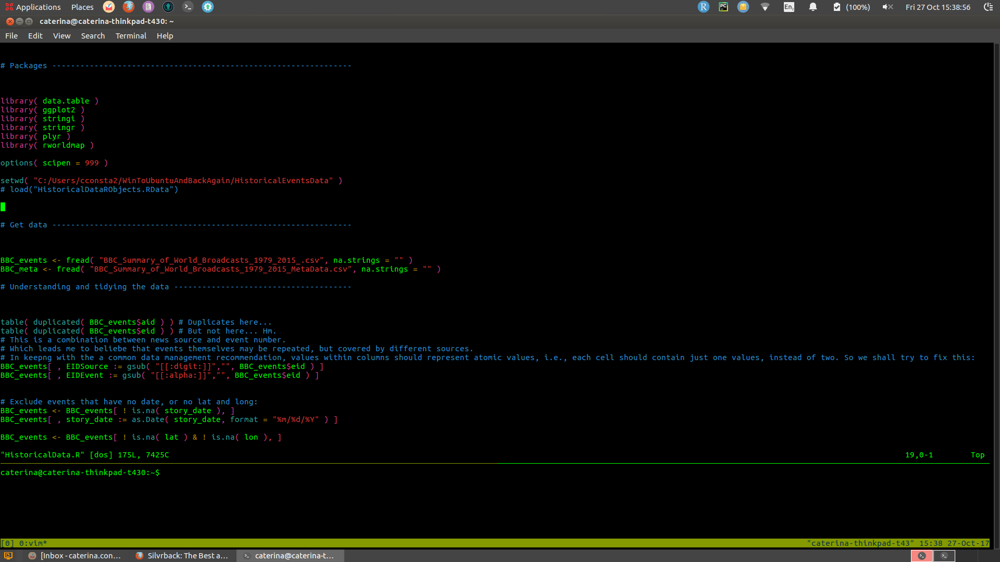

&nbsp;

Following my [previous post](https://datapowered.io/posts/2017-11-26-using-r-remotely/) on how to use `R` remotely, I thought I'd follow up with a slightly more in-depth description for how to use `R` via `vim`, and with `tmux`. This discussion will focus on how to get things working on Linux (Ubuntu) - which is what I am using.


After installing all three of these:

* [Vim](https://help.ubuntu.com/community/VimHowto) [(version >= 8.0)](https://itsfoss.com/vim-8-release-install/)

* [tmux](https://www.digitalocean.com/community/tutorials/how-to-install-and-use-tmux-on-ubuntu-12-10--2)

* [Nvim-R](https://raw.githubusercontent.com/jalvesaq/Nvim-R/master/doc/Nvim-R.txt)

we can proceed to do the following in a Terminal:


&nbsp;

## Using tmux

```console
$ tmux 

```

&nbsp;


Press `Ctrl + B` as the default prefix for all `tmux` commands, let go, and then immediately type: `"`. You have about a 1-2 second window to press the next key after the prefix, for `tmux` to accept your command. Once you've done this, your view will split in two horizontally and your cursor will move to the second pane. 

So now you will be seeing a top terminal and a bottom terminal - of equal widths. To reduce the width of the bottom terminal, hit the prefix again (`Ctrl + B`) to let `tmux` know it should listen for a command, and then let go of `B`, and while holding down the `Ctrl` tap the  '&darr;' as many times as desired. To move your cursor back to the top pane, you can hit: `Ctrl + B` again, let both go this time, and then quickly tap &uarr;. 

You can also find:

* multiple other shortcuts in [this nice cheat sheet](https://linuxacademy.com/blog/linux/tmux-cheat-sheet/)

* plus a tutorial [here](https://www.youtube.com/watch?v=nD6g-rM5Bh0).

If you've been following along, you should be seeing something like this:


Now, we're about to make things a little more interesting, and fire up `Vim` with an `R` script on display.


&nbsp;


## Using Vim with Nvim-R

If you like, head over [here](https://www.youtube.com/watch?v=SI8TeVMX8pk) first to watch a `Vim` tutorial. Otherwise, you can start like so:

```console
$ cd path/to/your/directory
$ vim foo.R
```
The code above either creates a foo.R file, or opens it if it already exists. Unless you're reusing `tmux` to split the view further into more panes, you can use `Vim` itself to open multiple files, and switch back and forth between them by typing `:n` or `:N`, which is useful for copying and pasting things across:

```console
$ cd /path/to/some/files
$ vim foo.R bar.R
```

&nbsp;

Anyway, when opening a single file you should see something like this:



&nbsp;

### Command mode

`Vim` starts by default in **command mode** - and this is the mode we'll need if we want to send `R` code from our script to the console for execution. As the name suggests, this mode lets you tap into a variety of really handy `Vim` commands. 

If you happen to be in any other mode, to revert back to this **command mode** you need to press `ESC` or `Ctrl + c`. Reverting to this mode is also really useful if you've made edits to your file in a different mode and want to undo them: returning in **command mode** you can undo things by pressing `u` (repeatedly, if necessary).

Assuming you haven't changed any of the `Nvim-R` defaults, you can let `Vim` know you want to start an `R` session by typing: `\rf` (or `\rq` to quit). That should immediately create a new pane, which looks like this:


Between the two top panes, you can use your mouse to go back and forth. However to switch from either of these to the bottom pane, you have to still use the keyboard shortcut I mentioned before:  `Ctrl + B` and then &darr;.

There are some other things you can do in this mode - for instance, scroll-like operations & navigating through your script (careful, some of these also automatically change the mode to **insert mode**):

* for navigating within the visible screen, press: `H` to jump to the top, `M` for the middle of screen, and `L` for lower in the screen (use caps here, small letters won't work);

* for navigating within the whole file: `Ctrl + F` takes you forward / towards the end of the file, and `Ctrl + B` takes you backwards / towards the beginning of your file;

* `G` jumps to the end of the whole file, and typing `33G` will take you to line 33 in your script;

* press `w` to keep jumping forward over every word within a line, and `b` to jump over words backwards;

* `$` gets you to the end of a line, and `0` (zero) takes you to its start.

For text manipulations in this mode, you can use:

* `dw` to **d**elete the **w**ord to the right of the cursor, on a given line;

* importantly, pressing `.` (period) repeats your last command;

* `d0` (d zero) deletes everything between the cursor position and the start of the line;

* `d$` deletes everything between the the cursor and the end of the line, whereas `10dd` deletes 10 lines beneath the current line. 


&nbsp;

### Insert mode

Other modes also exist in `Vim`. For instance, if you want to start editing your `R` script (e.g., typing new content etc.), you have to enter the so-called **insert mode**- which is what you get when you press `i`. Various keys and key combinations are your friends here, since you cannot use the mouse within the script.

>As a disclaimer, this part is all about the shortcuts! But don't worry - a lot of them are pretty intuitive and you don't need to try and memorize them. Just keep a cheat sheet handy - like this one [here](https://vim.rtorr.com/). Plus, you'll probably just end up learning most of them through repeated use.

Here is a quick list of handy ones:

* if you want to enter **insert mode** _and_ send your cursor to the beginning of a line, press capital `I` instead;

* the opposite command is `A`, which takes you into **insert mode** and drops the cursor at the end of a line, ready for editing;

* by contrast, small `a` simply enters **insert mode** at the end of the word your currently around;

* in a similar vein, `o` begins ('opens') a new line under your current one, and `O` does the same, but above your current line.

&nbsp;

### Last-line mode

Last line mode: you can get this by typing `:`

This is also the mode you need to be in to quit Vim , which can be done by typing: `:q`. If you've made changes to your document, Vim won't allow this. To proceed without saving the changes, you need to force the issue with: `:q!`. on the other hand, to save your changes and then quit, type: `:wq`. You can also save your progress with `:w` and then carry on working.

&nbsp;

### Visual or visual-line mode

You can enter these modes if you press `v` or `Shift + v`, respectively.

Careful here: in **visual mode**, `d` actually _cuts_ text for later pasting, rather than deleting it.

This mode is also very useful for copying/cutting and pasting tasks. To do this, you can place your cursor on a given line and then enter **visual mode** as shown above. If you then press &uarr; or &darr;, the text selection will follow accordingly. When finished, type `y` (yank) to copy the text, and then paste it somewhere else with `p`.

&nbsp;

## `Nvim-R` commands

I won't go into these in too much detail here because they are so nicely outlined in the Nvim-R manual [here](https://raw.githubusercontent.com/jalvesaq/Nvim-R/master/doc/Nvim-R.txt). However, have a bash at something like typing `\ll` to send a line of `R` code from `Vim` to the console.

Importantly, if you send a command to the console which produces a lot of output, you might wonder why you can't scroll up to see all of it. To do this, you need to press `Ctrl + \` and then `Ctrl + n`.

A very nice touch is also that you can type into the console: `?data.frame` and a help pane will show up. If you place your cursor inside this pane, you can then close it with `q`.

For plotting, if you type `plot( 1:10 )` into the `R` console, a pop-up will appear as well. See below:


---

This should be enough to get you started!


<!-- I recently needed a much more stripped down version of R, but with this same crucial dynamic: creating and saving code in an `R` script
Vim usage notes based on YouTube:

When done on a local machine, this creates a pop-up for a very basic plot. So I am assuming that if the process originates from the remote, without X11 forwarding this will not show up... So this would be a hurdle to get around, if you are planning on lots of data vis work...-->
