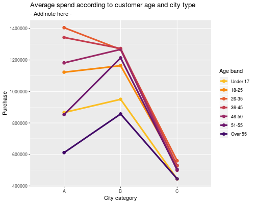

&nbsp;

I've recently presented a toy Shiny app at the [Edinburgh Data Visualization Meetup](https://www.meetup.com/meetup-group-vBHbCmgh/events/259694171/) to demonstrate how Shiny can be used to explore data interactively.

In my code-assisted walkthrough, I began by discussing the data used: a set of records detailing customer purchases made on Black Friday (i.e., each customer was given a unique ID, which was repeated in long format in the case of multiple purchases). Both the customers and the items purchased are described along various dimensions (e.g., customer city type, or item category etc.). You can find more details about this dataset on Kaggle [here](https://www.kaggle.com/mehdidag/black-friday).
 
After a basic set of data manipulations using `data.table` in R (see code below for details), the data was ready to be visualised with `ggplot2`. It is at this stage that I can share my first tip for designing Shiny apps:

&nbsp;

## Tip 1: Start small & build complexity iteratively

Consider starting with a **simple, static visualisation** (rather than building your Shiny app directly). This strategy helps to streamline the design process and deal with any potential problems one at a time. Starting with a static plot can also help to identify the best visualisation that can highlight the particular relationships you are trying to show in your data.


library( data.table )
library( ggplot2 )
library( viridis )

BFsales <- fread( "BlackFriday.csv" )

BFsales[ , User_ID := as.factor( User_ID ) ]
BFsales[ , Product_ID := as.factor( Product_ID ) ]
BFsales[ , Occupation := as.factor( Occupation ) ]
BFsales[ , Gender := as.factor( Gender ) ]
levels( BFsales$Gender ) <- c( "Female", "Male" )

BFsales[ , Stay_In_Current_City_Years := ordered( Stay_In_Current_City_Years, levels = sort( unique( Stay_In_Current_City_Years ) ) ) ]

BFsales[ , Marital_Status := factor( Marital_Status ) ]
levels( BFsales$Marital_Status ) <- c( "Married", "Single" )

BFsales[ , Product_Category_1 := as.factor( Product_Category_1 ) ]
BFsales[ , Product_Category_2 := as.factor( Product_Category_2 ) ]
BFsales[ , Product_Category_3 := as.factor( Product_Category_3 ) ]

BFsales[ , Age := ifelse( Age == "0-17", "Under 17", Age ) ]
BFsales[ , Age := ifelse( Age == "55+", "Over 55", Age ) ]
BFsales[ , Age := ordered( Age, levels = c( "Under 17", "18-25", "26-35",  "36-45", "46-50", "51-55", "Over 55" ) ) ]

# How much did *individuals* spend on average depending on city category and age?
purchase_by_age_agr <- aggregate( Purchase ~ User_ID + Age + City_Category, data = BFsales, FUN = sum )
purchase_by_age_agr <- aggregate( Purchase ~ Age + City_Category, data = purchase_by_age_agr, FUN = mean )

ggplot( purchase_by_age_agr, 
        aes( x = City_Category, y = Purchase, group = Age, color = Age ) ) + 
  geom_point( size = 2.5 ) +
  geom_line( lwd = 1.5 ) +
  scale_color_viridis_d( direction = -1, begin = 0.20, end = 0.85, option = "B" ) +
  labs( x = "City category",
        color = "Age band" ) +
  ggtitle( "Average spend according to customer age and city type",
           subtitle = "- Add note here -" )


 
Following the R code above, this is the plot you would get: 

After creating this static prototype, we can now start thinking about how to generalise it and integrate elements of interactivity (input menus) via Shiny. This would help us to investigate questions such as whether the product category affects the relationship shown, or whether customers' marital status, gender, or occupation have any influence as well? Tackling questions such as these with Shiny is a more powerful and elegant option, relative to generating large numbers of individual plots for each such scenario. 

So, how can we move to Shiny from here? I won't go into the details here (which I have done instead at the [meetup](https://www.meetup.com/meetup-group-vBHbCmgh/events/259694171/)), since several great tutorials are already available - notably [Dean Attali's](https://deanattali.com/blog/building-shiny-apps-tutorial/). You can also check out other important resources / documentation pages, e.g., the RStudio tutorials [here](http://rstudio.github.io/shiny/tutorial/) and [here](https://shiny.rstudio.com/articles). You can also have a look at the Shiny [app gallery](https://shiny.rstudio.com/gallery/) to get inspiration and choose a format that suits your needs.
 

However I will add several more tips that I have found very useful while developing Shiny apps - these range from usability issues, to efficiency and correct structure. As I've mentioned before, it can be really helpful to focus on these separately, once you've already determined what your outputs should in principle look like (when creating the static version of the plot):

&nbsp;

## Tip 2: Decide whether to prioritise particular subsets of data using filters with default settings

Think about the initial state of the app: should the view contain full data? If so, make sure the default options for the inputs cover *all* the options that exist in your data (e.g., a menu for selecting age group should have all checkboxes ticked by default, but users can later opt for looking at a single catergory if they so wish). 

However, it is very important to note what happens when missing values exist: these would get filtered out automatically by input menus with specific options, but is this something you want handled in this way? Perhaps the cases excluded in this way might present interest along other dimensions where they might instead present complete data.

&nbsp;

## Tip 3: Decide which objects (if any) should be shared across sessions

How should the app handle multiple connected sessions? It might be a good idea to have larger data objects / constants visible across all connected sessions for efficiency. It is worth thinking about this in more detail and setting up your app according to [**Scoping**](http://rstudio.github.io/shiny/tutorial/#scoping) guidance.

&nbsp;

## Tip 4: Beware of object dependencies

Make sure you are setting up the correct dependencies between reactive layers in your Shiny app: to make full use of Shiny's clever reactive system, you need to pay special attention to setting up the correct links between objects. A great post on [**Execution scheduling**](https://shiny.rstudio.com/articles/execution-scheduling.html) will go a long way towards clarifying this.

If you are curious about Black Friday sales, you can see the Shiny app in action below:

<iframe id="example1" src="https://thedatalab.shinyapps.io/BlackFridayShinyApp/" style="border: 0px solid black; width: 100%; height: 800px" frameborder="no"></iframe>

The code controlling the app's behaviour can be found on GitHub [here](https://github.com/TheDataLabScotland/BlackFridayShinyApp/blob/master/app.R), whereas the deployed version is [here](https://thedatalab.shinyapps.io/BlackFridayShinyApp/).

&nbsp;

## Further practice

If you like, feel free to build on my [example](https://github.com/TheDataLabScotland/BlackFridayShinyApp/blob/master/app.R) further. I've left out various menus that could still be included. So as practice, you could:

* Tweak the UI to include suitable inputs for:
    * Occupation
    * Marital status
    * Product category 2 or 3 (careful about handling missing data here) 
* Update the server function to use these newly-added inputs

