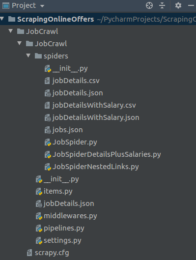
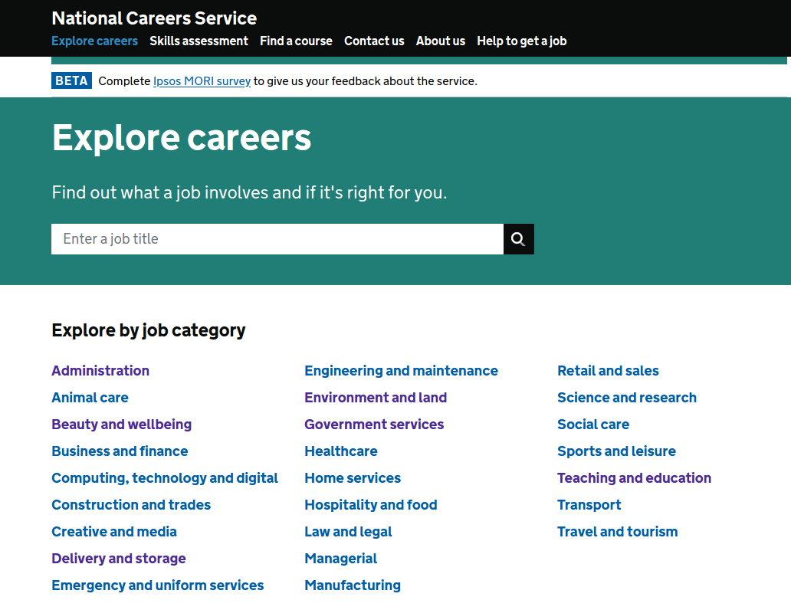
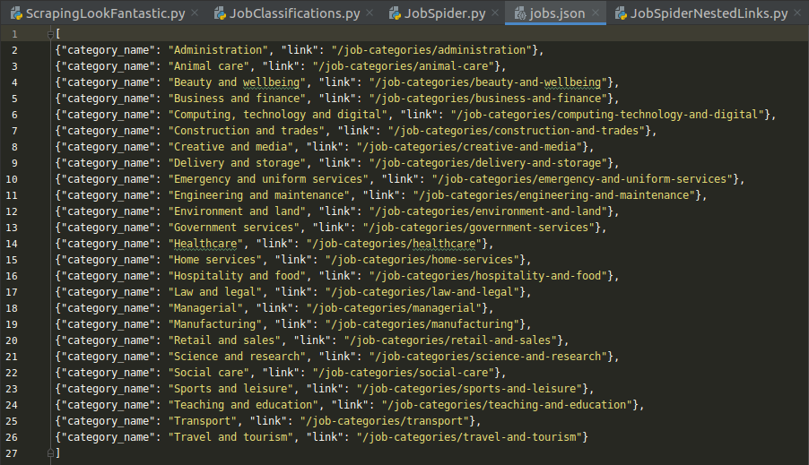
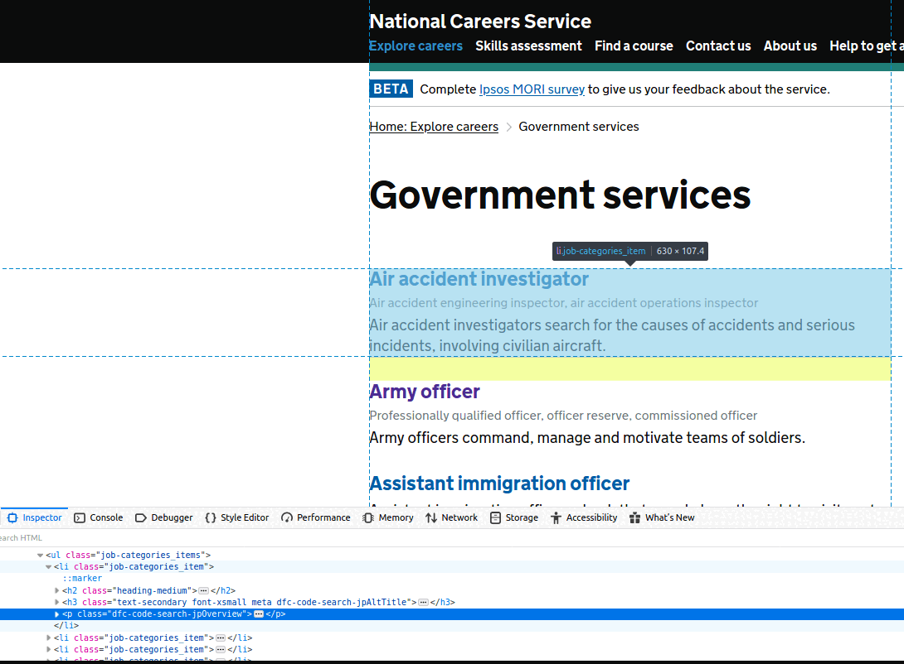
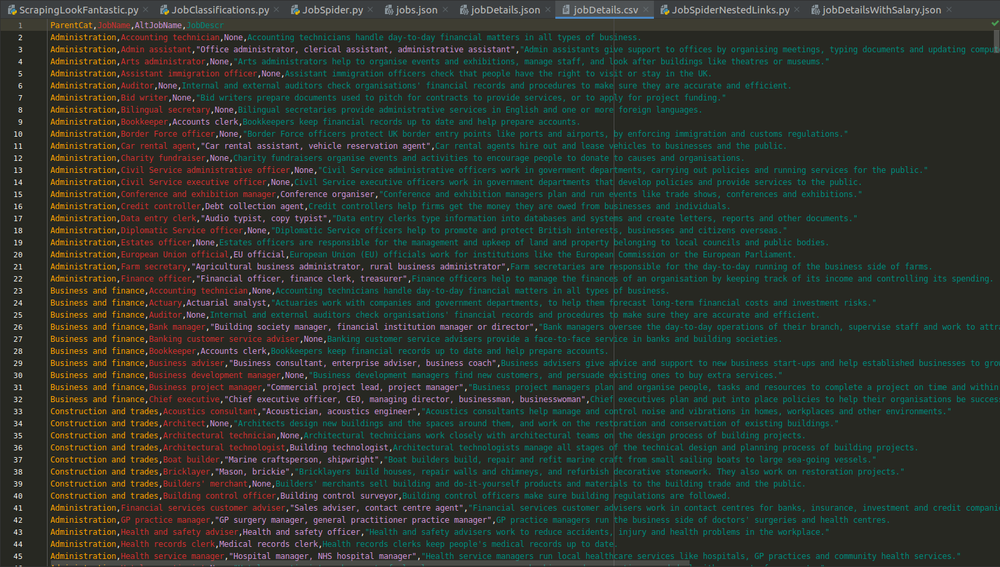
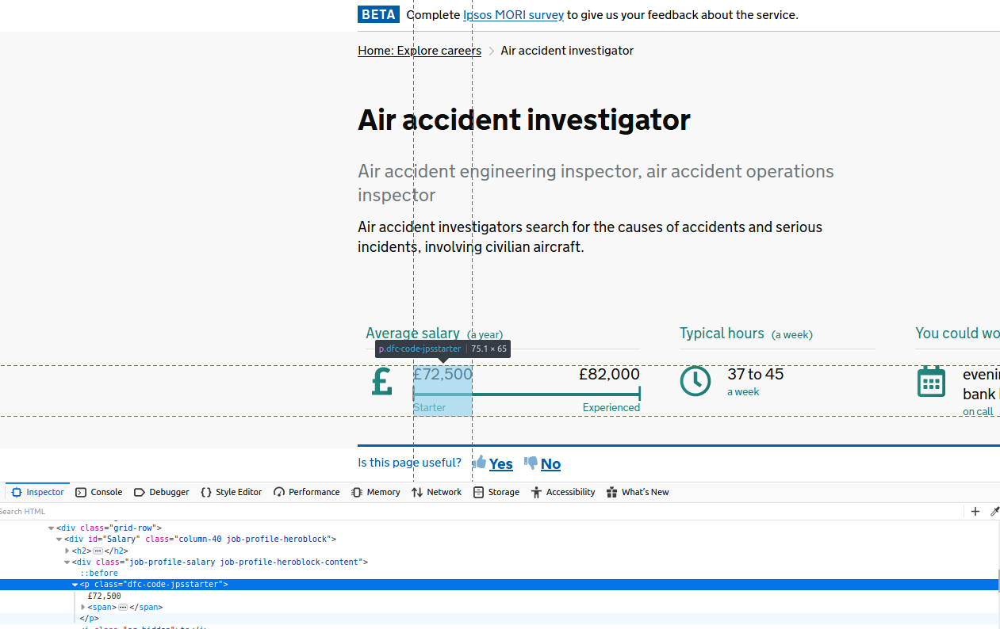
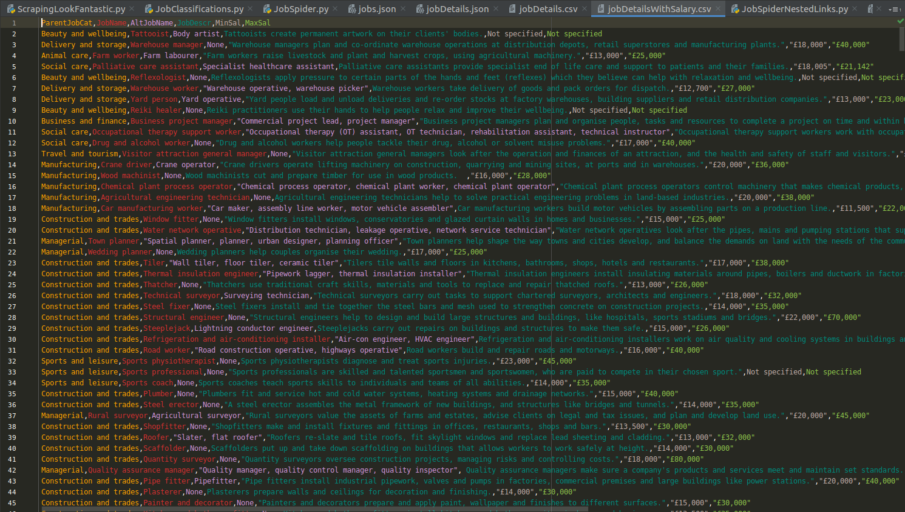

In my previous [post](https://datapowered.io/posts/2020-04-14-getting-started-with-scrapy/) about Scrapy, we covered the basics of how to use CSS and XPath selectors to extract specific content from sites. We also looked at an introductory example for how to scrape a single page containing an e-shop's active offers and discounts. No crawling between pages was required for that simple example, and we used the `requests` library to make the introduction extra gentle. 

In this post, I'll share a few details about how to create a Scrapy project, as well as spiders which can crawl between multiple webpages. We'll be able to achieve all this using just the `Scrapy` library as intended - without resorting to `requests`. We'll choose one page to start with, and build up the complexity from there.
 
 

## Creating a Scrapy project

This is really easy - you can just open a terminal, navigate to a parent directory of choice, and then set up a new project like so:


cd /path/to/my/desired/proj/location
scrapy startproject MyProjName


What you will then see will be similar to this (except below I've already added a few additional files):

 
Afterwards, you can just run any spiders you create as part of this project (and direct their output to a file) using:
 

scrapy crawl mySpidersClassName -o /path/to/collect/my/scraped/output.csv

 
The spider class name (`mySpidersClassName`) will be something we provide within our code, regardless of what we name the script it lives in.
 
 

 
 
## Example 1: Extracting broad job classes

First, we'll be extracting the **list of broad job categories** from [this page](https://nationalcareers.service.gov.uk/explore-careers) on the National Careers Service site. There you'll see a list of job classes such as 'Science and research', 'Construction and trades' or 'Government services' and so on.
 

How might we go about extracting these job classes and their associated URLs using Scrapy? Check out the code snippet below to find out:


import scrapy

class jobsSpider(scrapy.Spider):
    name = "jobs"
    start_urls = [
        "https://nationalcareers.service.gov.uk/explore-careers"
    ]
    def parse(self, response):
        for category in response.css('.homepage-jobcategories > li'):
            yield {
                'category_name' : category.css("::text").get(),
                'link' : category.css("a::attr(href)").get()
            }


What we've done above is create a new instance of the `scrapy.Spider` class, and chosen `jobs` as its name - this is important as we will need to refer to this name when launching this spider from the command line. Other than that, everything else should look relatively straightforward: we supply a URL of interest, and then provide instructions for what information to grab from there, via a custom *parsing method* with specific CSS selectors. 

Parsers are essential to be able to scrape content, and we can use several of them in any given spider - as you'll soon see. In this particular example, we design the parser to loop over all list items within the page (`li`, aka job classes here), and for each item, it should yield (return) a category name as well as its URL. 

At this point, we are ready to launch our spider and append its output to a file - in this case, we could make it a `.json` (but equally it could have been a `.csv`, for example):


scrapy crawl jobs -o jobs.json


 

The output should look like this:

 

 

## Example 2: Job details (names and descriptions)

Suppose we wanted to go one step further and extract not just the broad job classes and their URLs as above, but also **the entire list of individual job details** which fall under the incidence of each broad class. This means for example that we'd want all the specific info listed for each job under the banner of 'Construction and trades' or 'Government services' and so on. 

The first place to start is the Inspector, part of Web Developer tools (most browsers should have a version of these, but I am using Firefox). You can see in the slideshow below that this will easily expose the appropriate CSS/XPath selectors for the elements we are interested in. So for example, for all jobs in 'Government services', we are after their **job name, any alternative job names, and their job description**:

 

To reach this extra set of job-specific details, we need to *crawl between pages*, using as a starting point the URLs we just extracted in the previous example. But how? To find out, see the code snippet below:


# To make things easier, if you wanted to explore the output of various selectors, 
# you could still resort to the requests package as follows:
# url = "https://nationalcareers.service.gov.uk/job-categories/government-services"
# html = requests.get(url).content
# response = Selector(text = html)

import scrapy

root = "https://nationalcareers.service.gov.uk/explore-careers"

class nestedJobSpider(scrapy.Spider):
    name = "jobDetails"

    def start_requests(self):
        yield scrapy.Request(url=root, callback=self.parse)

    def parse(self, response):
        links = response.css('.homepage-jobcategories > li a::attr(href)').extract()
        for link in links:
            yield response.follow(url = link, callback = self.parse2)

    def parse2(self, response):
        parent_job_category = response.css('.heading-xlarge::text').extract()
        job_list_items = response.css('.job-categories_item')

        for job in job_list_items:
            j_name = job.css('.dfc-code-search-jpTitle::text').extract_first()

            alt_j_name = job.css(".dfc-code-search-jpAltTitle::text").extract_first()
            if not alt_j_name:
                alt_j_name = "None"

            j_descr = job.css('.dfc-code-search-jpOverview::text').extract_first()

            print(j_name)
            yield {
                'ParentCat' : parent_job_category,
                'JobName': j_name,
                'AltJobName': alt_j_name,
                'JobDescr': j_descr
            }

# Then to run in terminal:  
# scrapy crawl jobDetails -o /my/path/JobCrawl/JobCrawl/spiders/jobDetails.json


So what did we do differently here, relative to the previous example? Well, much like before, we still need to declare a starting point (this time declared as the `root`) and we still have a parsing method that extracts the broad job classes - with the notable exception that _this time_, this first parser no longer yields its output directly, but rather indicates which URLs to follow further, via `response.follow`. It will be the job of the *next* parser to yield output to a file: `parse2` achieves just that, by extracting the broad job class itself (as `parent_job_category`), and only then picking off the items on the page one by one, and further extracting for each of them: the job name, alternative job name (if present, as `alt_j_name`), and finally the job description (`j_descr`).

After all the said and done, running the spider above in the terminal should produce some nice, tidy-looking output:

 

 

## Example 3: Job details (salaries)

At this stage, we have already figured out how to write a basic Scrapy spider, create a `Request` object, and provide one or more _parsing methods_ to act upon that, as the spider crawls between multiple pages. But let's say we wanted to dive even deeper into the site hierarchy, and for each job **extract the minimum and maximum salary**. Clicking through an individual job and exploring it via the Inspector, this would look like:

So how do we modify our spider to add salary details to all the previous information? I will show you this below. But the most important message to get across is probably this: while you may notice a fair bit of overlap with what was already discussed previously, the crucial difference here is the use of a `meta` dictionary. Independent parsers access different bits of information from different pages. What this means in practice is that we need to temporarily hold on to the information we already extracted about job names and descriptions, while we further extract salary information, and only then yield *all* the information to an output file in one go. But scoping issues prevent parsers from communicating directly with each other - hence the way to get around this is via Scrapy's `meta` attribute - a dictionary that multiple parsers can add information to, before it finally yields its output in one go.  


import scrapy
from collections import defaultdict

root = "https://nationalcareers.service.gov.uk/explore-careers"

class nestedJobSpider(scrapy.Spider):
    name = "jobDetailsWithSalary"

    def start_requests(self):
        yield scrapy.Request(url = root, callback = self.parse)

    def parse(self, response):
        links = response.css('.homepage-jobcategories > li a::attr(href)').extract()
        for link in links:
            yield response.follow(url = link, callback = self.parse2)

    def parse2(self, response):

        parent_job_category = response.css('.heading-xlarge::text').extract_first()

        job_list_items = response.css('.job-categories_item')
        for job in job_list_items:
            j_name = job.css('.dfc-code-search-jpTitle::text').extract_first()

            alt_j_name = job.css(".dfc-code-search-jpAltTitle::text").extract_first()
            if not alt_j_name:
                alt_j_name = "None"

            j_descr = job.css('.dfc-code-search-jpOverview::text').extract_first()

            # Extract the URL from the job box to dig deeper and also get min & max salaries:
            fine_job_details = job.css('.dfc-code-search-jpTitle ::attr(href)').extract_first()
            print(fine_job_details)

            item = defaultdict(list)
            item['ParentJobCat'] = parent_job_category
            item['JobName'] = j_name
            item['AltJobName'] = alt_j_name
            item['JobDescr'] = j_descr

            yield response.follow(url = fine_job_details,
                                  callback = self.parse3,
                                  meta={'item': item}) # Save item here to pick up later in parse3

    def parse3(self, response):

        item = response.meta['item']  # retrieve item generated in previous request

        min_sal = response.css('.dfc-code-jpsstarter::text').extract_first()
        max_sal = response.css('.dfc-code-jpsexperienced::text').extract_first()

        if not min_sal:
            min_sal = "Not specified"
        else:
            min_sal = min_sal.strip()

        if not max_sal:
            max_sal = "Not specified"
        else:
            max_sal = max_sal.strip()

        print(min_sal + " - " + max_sal)

        item['MinSal'] = min_sal
        item['MaxSal'] = max_sal
        print(item)

        yield item

# In terminal:
# cd /my/path/PycharmProjects/ScrapingOnlineOffers/JobCrawl/JobCrawl/spiders
# scrapy crawl jobDetailsWithSalary -o /path/to/my/output/jobDetailsWithSalary.json


Executing the code above will result in the addition of two further dimensions to the data we had already managed to extract previously:

 
 

## Summary

In this post:

* We began by setting up an empty Scrapy project. 

* We then created our first spider to extract just broad job classes and their URLs.

* Next, we actually followed these URLs to access further details such as any alternative job names and job descriptions. 

* Finally, we pursued each individual job even further through a second set of links in order to access salary information. 

Hopefully this gradual approach was helpful to show a few things that can be done with Scrapy!

